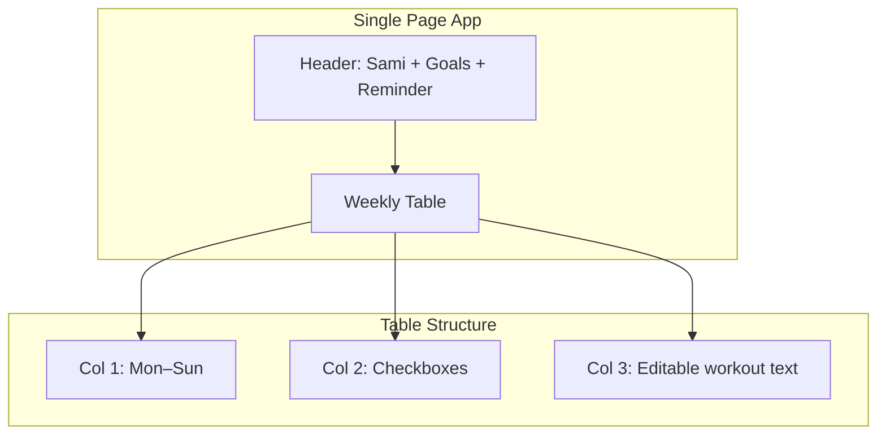
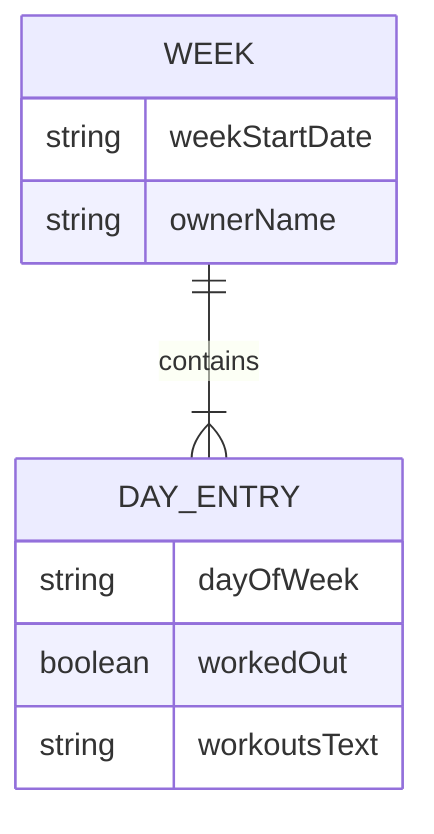
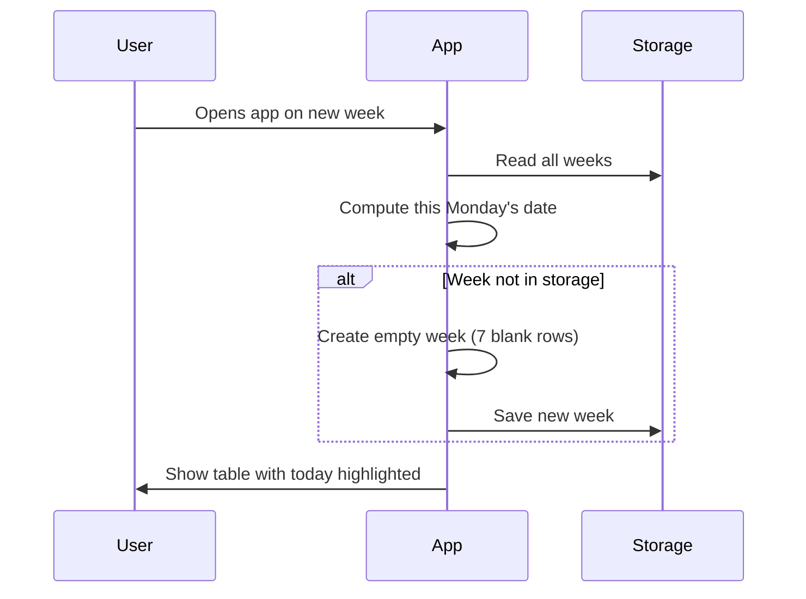
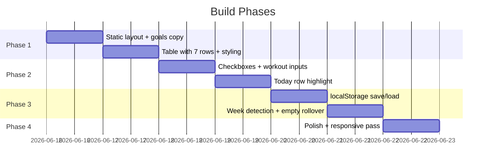
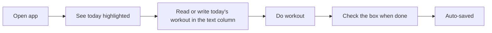
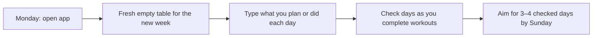

# Workout Progression Tracker — Implementation Plan

A greenfield web app for **Sami** that tracks weekly workouts with checkboxes, workout notes, and today highlighting — aligned with the "consistent small gains" philosophy.

---

## 1. Core idea

| Principle | How the app supports it |
|-----------|-------------------------|
| 3–4 workouts per week | Stated in the goals text; you count checked days yourself |
| Same or slightly better than last week | You type what you did; compare mentally week to week |
| Avoid overreaching | Explicit reminder in the UI |
| Long-term consistency | One simple weekly table; data persists across weeks |

---

## 2. How the table works

The **workout column** and the **checkbox** are independent:

| Checkbox | Workout text | Meaning |
|----------|--------------|---------|
| ☐ unchecked | Empty | Rest day or nothing planned yet |
| ☐ unchecked | Filled in | **Planned** — you intend to do this, or wrote it ahead of time |
| ☑ checked | Filled in | **Done** — you worked out that day |
| ☑ checked | Empty | Unusual; you worked out but didn't log details |

**Important:** Text in a row does **not** mean you worked out. Only the checkbox means "I worked out today." So yes — in a confusing example, Monday with text but no check would mean you planned bench day but didn't go through with it (or haven't yet). The wireframe below uses a clearer story instead.

---

## 3. Screen layout (wireframe)

Example: today is **Wednesday**. You worked out Monday and Tuesday; Wednesday's workout is planned but not done yet.

```
┌─────────────────────────────────────────────────────────────────────────────┐
│  Sami                                                                       │
│                                                                             │
│  Goals:                                                                     │
│    1. Exercise 3–4 times this week                                          │
│    2. Do the same amount as last week or improve it incrementally           │
│                                                                             │
│  Intentionally DO NOT try to do too much more than last week                │
│                                                                             │
├──────────┬──────────┬──────────────────────────────────────────────────────┤
│   Day    │ Worked   │  Workouts (done or planned)                          │
│          │   out?   │                                                      │
├──────────┼──────────┼──────────────────────────────────────────────────────┤
│  Mon     │    ☑     │  Bench 3×8 @ 135, Rows 3×10 @ 90        (done)      │
├──────────┼──────────┼──────────────────────────────────────────────────────┤
│  Tues    │    ☑     │  Walk 30 min, 5,000 steps                 (done)      │
├──────────┼──────────┼──────────────────────────────────────────────────────┤
│  Wed     │    ☐     │  Squats 3×8 @ 185, RDL 3×10 @ 135       (planned)    │  ← TODAY
│          │          │  (highlighted row — soft background + left border)   │
├──────────┼──────────┼──────────────────────────────────────────────────────┤
│  Thurs   │    ☐     │  OHP 3×8 @ 95, Pull-ups 3×6             (planned)    │
├──────────┼──────────┼──────────────────────────────────────────────────────┤
│  Fri     │    ☐     │                                                      │
├──────────┼──────────┼──────────────────────────────────────────────────────┤
│  Sat     │    ☐     │                                                      │
├──────────┼──────────┼──────────────────────────────────────────────────────┤
│  Sun     │    ☐     │                                                      │
└──────────┴──────────┴──────────────────────────────────────────────────────┘
```

**Column widths (approximate):**

- Day: narrow (~80px)
- Checkbox: narrow (~60px, centered)
- Workouts: **flexible / ~70–80%** of table width

**Header block:**

- Top-left: **"Sami"** (owner label)
- Below: goals (static copy)
- Reminder line (static copy)

---

## 4. Visual design (high level)



**Today highlight:**

- Light accent background on the current day's row
- Optional left border (e.g. 3px) in a distinct color
- Does not block editing

**Responsive behavior:**

- Desktop: full table as above
- Mobile: same columns; workout column stacks below day + checkbox on very small screens if needed

---

## 5. Data model

Each **week** is keyed by **week start date** (Monday).



**Example (conceptual JSON):**

```json
{
  "ownerName": "Sami",
  "currentWeekStart": "2026-06-16",
  "weeks": {
    "2026-06-16": {
      "Mon": { "workedOut": true, "workouts": "Bench 3×8 @ 135, Rows 3×10 @ 90" },
      "Tues": { "workedOut": true, "workouts": "Walk 30 min, 5,000 steps" },
      "Wed": { "workedOut": false, "workouts": "Squats 3×8 @ 185, RDL 3×10 @ 135" }
    }
  }
}
```

**Storage (phase 1):** `localStorage` in the browser — no account, works offline, good for a personal tracker.

**Storage (optional later):** simple backend or sync if you want multiple devices.

---

## 6. Week rollover

When a new calendar week starts (Monday), the app creates a **fresh empty week** — blank workout cells, all checkboxes unchecked. Previous weeks stay saved for reference.



**Week definition:** Monday = start (matches your Mon–Sun column order).

---

## 7. Features checklist

| Feature | Priority | Description |
|---------|----------|-------------|
| Weekly table (Mon–Sun) | Must | Fixed 7 rows |
| Name "Sami" top-left | Must | Static or configurable later |
| Workout checkboxes | Must | Toggle per day — means "I worked out" |
| Large workout column | Must | Multi-line text per day (done or planned) |
| Today highlight | Must | Based on device date/timezone |
| Goals + reminder copy | Must | As specified |
| Persist data | Must | Survive refresh |
| Previous weeks view | Could | Read-only history |
| Auto-fill from last week | Could (later) | Copy last week's workout text into new week |
| Incremental improvement hints | Could (later) | Compare this week's text to last |

---

## 8. Recommended tech stack

Keep it simple for a personal tracker:

| Layer | Choice | Why |
|-------|--------|-----|
| Framework | **React** or **vanilla HTML/CSS/JS** | Small scope; React helps with state |
| Styling | **CSS** or **Tailwind** | Table layout + today row styling |
| Build | **Vite** | Fast dev, easy deploy |
| Storage | **localStorage** | No server for v1 |
| Deploy | **Netlify / Vercel / GitHub Pages** | Free static hosting |

No database or auth in v1 unless you want multi-device sync later.

---

## 9. Implementation phases



### Phase 1 — Shell
- Page structure: header, goals, reminder, empty table
- Column headers: Day | Worked out? | Workouts

### Phase 2 — Interaction
- Checkboxes wired to state
- Text areas/inputs in workout column (multi-line)
- Highlight today's row

### Phase 3 — Persistence
- Save/load from localStorage on every change
- Detect new week; create empty week record

### Phase 4 — Polish
- Focus styles, readable fonts, comfortable row height
- Mobile responsive pass
- Test week boundary (simulate "next Monday")

---

## 10. User flows

**Daily use:**



**Start of new week:**



---

## 11. Design tokens (suggested)

| Element | Suggestion |
|---------|------------|
| Font | System UI or Inter |
| Table | Light borders, generous padding in workout column |
| Today row | Soft blue/amber background (~10% opacity) |
| Goals | Slightly smaller text, left-aligned under "Sami" |
| Reminder | Italic or muted color — stands out without shouting |
| Checkbox column | Centered, large enough tap target on mobile |

---

## 12. Out of scope for v1 (on purpose)

- Login / multiple users
- Auto-copy workouts from last week
- Live "workouts this week" counter
- Exercise libraries or templates
- Automatic "+1 rep" math
- Charts and long-term analytics
- Notifications

These can come later if you want; v1 stays focused on the weekly table and consistency.

---

## 13. Success criteria

You'll know v1 works when:

1. Opening the app shows **Sami**, goals, and the reminder.
2. **Today's row** is visually obvious.
3. You can check days and type workouts; refresh keeps everything.
4. On a **new week**, you get a fresh empty table (previous week saved separately).
5. Checkbox = worked out; text = what you did or plan — the two stay independent.

---

## 14. Next step when you're ready to build

When you want implementation, we can:

1. Scaffold the project (Vite + React or plain HTML).
2. Build Phase 1–2 (layout + interactions).
3. Add persistence and week rollover (Phase 3).
4. Deploy to a free static host.

If you have preferences (React vs plain HTML, colors, or making "Sami" editable later), say so and the build can follow this plan exactly.
